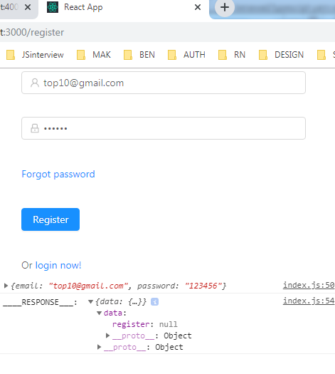
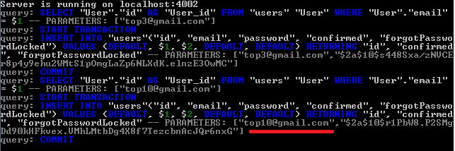
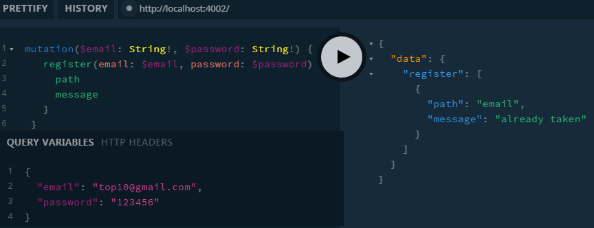

Available for download. Simple controller

{
  "private": true,
  "workspaces": {
    "packages": [
      "packages/*"
    ],
    "nohoist": [
      "**/jest",
      "expo",
      "expo/**"
    ]
  }
}

  "nohoist": [
    "**/jest",
    "expo",
    "expo/**",
    "apollo-boost",
    "apollo-boost/**",
    "react-apollo-hooks",
    "react-apollo-hooks/**"
  ],